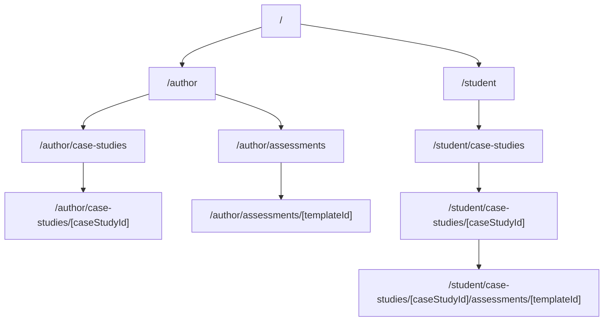

# Prototype Alpha Specification (Authoring + WDL + Schema)

## Purpose

Prototype Alpha exists to explore the **core concepts** of EHR simulation software for nursing education—without overcommitting to final implementation details, product scope, or long-term standards decisions.

This spec is written to be:
- **Schema-first**: a versioned case study document format that can evolve toward a public/open format.
- **Local-first**: progress is always saved in the browser; syncing is explicit and recoverable.
- **Cost-conscious**: minimize database writes, avoid always-on services, and lean on caching and client-side logic.
- **Next.js-aligned**: prefer **Next.js Server Actions** for backend operations when needed.
- **Supabase-backed**: Supabase is the durable store for shared artifacts (published cases, templates, submissions).
- **Navigation**: recommended app shell and Next.js routes are described under **Information architecture** (below).

## Non-goals (Prototype Alpha)

- Supporting real patient data (no PHI). All content is mock/synthetic.
- Full fidelity EHR workflows (orders, billing, interoperability, auditing) beyond what’s needed for the demo journeys below.
- Full FHIR compliance. We will keep the schema **compatible with future alignment** (mapping-friendly) without adopting FHIR as a requirement now.
- Highly granular role-based access control and enterprise auth flows (we can stub or simplify).
- Perfect scoring/rubrics for WDL; the goal is to demonstrate a configurable WDL structure and persistence of student submissions.

## Personas

- **CaseStudyAuthor**: creates and iterates on simulation case studies; wants forms plus assisted generation to move faster.
- **Student**: consumes a case study and completes a WDL assessment; expects autosave, resumability, and clear submission state.

## Prototype Alpha user journeys

### Author journey A: Create a case study (manual)

- Start a new case study draft.
- Fill out a guided series of forms:
  - Patient demographics
  - Past health record summary
  - Encounter/timeline entries (notes, labs, meds, vitals as applicable)
  - Optional attachments/links (no binary upload required for Alpha)
- Save continuously (local-first).
- Optionally “Publish” (sync to Supabase) to share the case study.

### Author journey B: Create a case study (prompt-assisted in-form)

- While editing any section, choose “Generate” or “Improve” (prompting).
- Provide a short prompt (and optionally constraints like age range, conditions, unit type).
- The system generates a **structured patch** (field-level suggestions) that the author reviews and applies.
- Generated content is tracked in **provenance metadata** (for transparency and iteration).

### Author journey C: Configure a WDL assessment for a case

- Select a case study (draft or published).
- Create a WDL assessment template:
  - Define sections/domains
  - Define items/criteria (“Within defined limits” checks) and response types
  - Configure constraints (e.g., expected ranges for vitals, or allowed choices)
- Save (local-first), optionally publish to Supabase.

### Student journey D: Complete and submit a WDL assessment

- Open a case study and its associated WDL assessment template.
- Fill out the WDL assessment (per item).
- Autosave progress locally; resumable across reloads.
- Submit final responses; persist submission to Supabase when available.

## Information architecture

This section describes **where** author and student experiences live in the UI and **which routes** should own them. It complements **Prototype Alpha user journeys** (behavior) and **Data contracts** (documents). JSON types remain the source of truth; routes are **views** over those documents.

### Principles

- **Persona-first areas**: separate **Author** and **Student** workspaces so navigation and mental models stay clear (see Security and data policy for simplest-possible separation).
- **Deep-linkable artifacts**: case studies, **assessment templates** (WDL is one supported format), and in-progress submissions should be addressable by stable IDs in the URL where it improves recovery and sharing (fits local-first persistence and resumability).
- **Explicit sync surfaces**: “Publish” and “Submit” remain **deliberate actions** on screens tied to those artifacts—not only in global chrome.
- **Synthetic-data visibility**: persistent or prominent **mock / synthetic data only** messaging at the app shell level (cross-reference Security and data policy).

### App shell

The root layout is conceptually divided into:

| Region | Role |
| --- | --- |
| **Global notice** | Mock-data disclaimer |
| **Primary nav** | Persona/workspace switch (Author vs Student), home |
| **Main** | Page content; optional **secondary nav** (tabs or sidebar) for multi-section authoring |

Long **case study authoring** flows (journeys A and B) benefit from **section navigation** (tabs or vertical nav) within a single case study editor rather than many top-level routes. Optional sub-routes or a `?step=` query may be used for bookmarking; the editor route remains the primary shell.

### Routes and pages (Next.js App Router)

Implementation should follow the **[Next.js App Router](https://nextjs.org/docs/app)** (`app/` directory): **route groups** (parentheses; no URL segment) may separate author vs student layouts, and **dynamic segments** identify artifacts (e.g. `[caseStudyId]`, `[templateId]`, `[submissionId]`).

**Nomenclature**: Information architecture uses **assessments** as the capability (authoring templates, student attempts, submit). **WDL** (“Within Defined Limits”) remains an assessment *format* in schema and JSON types (`WdlAssessmentTemplate`, etc.); URLs and navigation should not imply WDL is the only kind of assessment.

**Recommended URL structure:**



- **`/`**: Landing with two clear entry points (**Author workspace**, **Student workspace**).
- **Author**
  - `/author`: Author hub (recent drafts, shortcuts to new case study or assessment templates).
  - `/author/case-studies`: List local and synced case studies (draft vs published reflected in UI as needed).
  - `/author/case-studies/[caseStudyId]`: **Case study editor**: guided forms (demographics, summary, timeline, attachments); **Generate** / **Improve** per section (journeys A and B); **Publish** action.
  - `/author/assessments`: List assessment templates; creating new may require or suggest a `caseStudyId` (journey C). Templates may use WDL or other formats over time.
  - `/author/assessments/[templateId]`: Assessment template builder (domains, items, response types, constraints); **Publish** action.
- **Student**
  - `/student`: Student hub (resume in-progress work, browse published case studies).
  - `/student/case-studies`: Browse **published** case studies available to run.
  - `/student/case-studies/[caseStudyId]`: Read-only case presentation (e.g. timeline).
  - `/student/case-studies/[caseStudyId]/assessments/[templateId]`: Run an assessment: fill, local autosave, **Submit** (journey D).

**Implementation notes**

- Route groups such as `app/(author)/...` and `app/(student)/...` can provide different nested layouts (e.g. author sidebar vs simpler student layout) without changing the URLs above.
- **Server Actions** for publish and submit align with Architecture constraints; colocate actions with features or place them under `app/actions/` as preferred—feature-local actions are a reasonable default.
- Parallel routes and intercepting routes for modal-heavy flows are **optional** and can be deferred (see Open questions).

### Journey mapping

| Journey | Primary routes | Key actions |
| --- | --- | --- |
| **A** (manual case study) | `/author/case-studies`, `/author/case-studies/[caseStudyId]` | Debounced local autosave; **Publish** |
| **B** (prompt-assisted case study) | Same as A | Structured patch review/apply; provenance; **Publish** |
| **C** (assessment template for a case) | `/author/case-studies` (select case), `/author/assessments`, `/author/assessments/[templateId]` | Local save; **Publish** template |
| **D** (complete assessment) | `/student/case-studies`, `/student/case-studies/[caseStudyId]`, `/student/case-studies/[caseStudyId]/assessments/[templateId]` | Local autosave; **Submit** |

### Future considerations

If draft documents outgrow **localStorage**, the same routes and views apply; only the client storage tier changes (e.g. IndexedDB) per Local-first drafts, sync, and caching.

### What this section does not specify

- **API routes vs Server Actions**: only high-level alignment with Architecture constraints—pages and layouts are the focus here.
- **Full UI design**: not a visual or component-level mock; enough detail to implement routing and shells consistently.

## Architecture constraints (implementation guidance, not mandates)

- **Preferred backend shape**: Next.js Server Actions for “publish/sync/submit” operations (see **Information architecture** for how feature routes relate).
- **Client-heavy**: editing, validation, and draft autosave run in the browser.
- **Caching**:
  - Client caches case study documents/templates by `id` + `updatedAt` (or `contentHash`).
  - Server-side caching can be used for read-mostly published content (avoid repeated DB reads).
- **Write minimization**:
  - Do not write to Supabase on every keystroke.
  - Prefer explicit “Publish/Sync” events and a small number of background retries.

## Data contracts

### Design principles

- **Versioned documents**: each top-level document includes `schemaVersion`.
- **Stable identifiers**: `id` should be a UUID (or similar). IDs must be stable across edits.
- **Extensibility**:
  - Unknown fields must be preserved when round-tripping.
  - Vendor/experimental fields use an `x_` prefix (e.g., `x_generationHints`).
- **Mapping-friendly**: use concepts that can later be mapped to standards (e.g., “Observation-like” entries) without committing to them now.
- **Compatibility rules**:
  - Consumers **must ignore unknown fields**.
  - Producers **must not remove unknown fields** when editing and re-saving a document.
  - Patch operations (manual or generated) should target the smallest reasonable scope to reduce merge conflicts.

### CaseStudyDocument v0.1

#### Summary

`CaseStudyDocument` is the primary portable artifact. It is a single JSON document describing a simulated patient and their relevant health history and scenario timeline.

#### Minimal required fields

- `schemaVersion`: `"caseStudy@0.1"`
- `id`: string
- `title`: string
- `patient`: object (minimal demographics)
- `timeline`: array (can be empty in early drafts)

#### JSON shape (illustrative; not a strict JSON Schema yet)

```json
{
  "schemaVersion": "caseStudy@0.1",
  "id": "case_9f6b7c0d-1f9a-4f8d-9e66-5a2e2a6d1f6b",
  "title": "COPD Exacerbation: ED to Med-Surg",
  "description": "Adult patient presents with shortness of breath; focus on assessment, oxygenation, and documentation.",
  "tags": ["pulmonary", "med-surg", "adult"],
  "createdAt": "2026-03-30T00:00:00.000Z",
  "updatedAt": "2026-03-30T00:00:00.000Z",
  "status": "draft",
  "patient": {
    "displayName": "Avery Jordan",
    "dateOfBirth": "1968-08-12",
    "sexAtBirth": "female",
    "genderIdentity": "female",
    "preferredPronouns": "she/her",
    "race": "White",
    "ethnicity": "Not Hispanic or Latino",
    "language": "English",
    "contact": {
      "phone": "555-0100",
      "email": "avery.jordan@example.test"
    },
    "address": {
      "line1": "100 Main St",
      "city": "Springfield",
      "state": "MA",
      "postalCode": "01101",
      "country": "US"
    },
    "identifiers": {
      "mrn": "MRN-0001234",
      "x_externalIds": []
    }
  },
  "context": {
    "careSetting": "ED",
    "organizationName": "Prototype Hospital",
    "unit": "Emergency Department",
    "x_program": "Nursing"
  },
  "summary": {
    "chiefComplaint": "Shortness of breath",
    "hpi": "Worsening dyspnea over 3 days with increased sputum production.",
    "pmh": ["COPD", "HTN"],
    "psh": [],
    "allergies": ["NKDA"],
    "homeMeds": [
      { "name": "Albuterol inhaler", "sig": "2 puffs q4-6h PRN", "route": "inhaled" }
    ]
  },
  "timeline": [
    {
      "id": "evt_1",
      "type": "encounter",
      "occurredAt": "2026-03-30T12:05:00.000Z",
      "title": "ED Triage",
      "data": {
        "vitals": { "hr": 110, "rr": 26, "spo2": 89, "tempC": 37.1, "bp": "154/92" },
        "note": "Patient anxious, speaking in short phrases."
      }
    },
    {
      "id": "evt_2",
      "type": "lab",
      "occurredAt": "2026-03-30T12:30:00.000Z",
      "title": "ABG",
      "data": { "ph": 7.33, "pco2": 54, "po2": 62, "hco3": 28 }
    }
  ],
  "assessments": {
    "wdlTemplates": [
      {
        "templateId": "wdl_tpl_3b0d3b2f-2c3c-4a36-9b14-08f8b2a9d3a1",
        "label": "WDL: Respiratory Assessment",
        "x_defaultForStudents": true
      }
    ]
  },
  "attachments": [
    {
      "id": "att_1",
      "type": "link",
      "title": "CXR report (mock)",
      "url": "https://example.test/cxr-report"
    }
  ],
  "provenance": {
    "authoredBy": { "actorType": "human", "actorId": "author_local_1" },
    "generatedBy": [
      {
        "generatedAt": "2026-03-30T00:10:00.000Z",
        "tool": "chromePromptApi",
        "scope": "summary.hpi",
        "promptSummary": "Generate a realistic HPI for COPD exacerbation; ED setting; include duration and sputum changes.",
        "x_model": "unknown"
      }
    ]
  },
  "x_extensions": {}
}
```

#### Notes on `timeline`

To keep the schema flexible, timeline entries are intentionally “typed envelopes”:
- `type` is a stable discriminator (`encounter`, `note`, `lab`, `medication`, `vitals`, `imaging`, `procedure`, `assessment`, `other`)
- `data` is type-specific and can evolve without breaking the top-level structure

### WdlAssessmentTemplate v0.1

#### Summary

`WdlAssessmentTemplate` defines the structure of a “Within Defined Limits” assessment. A template is authored/configured, then used to collect student submissions.

#### Minimal required fields

- `schemaVersion`: `"wdlTemplate@0.1"`
- `id`: string
- `title`: string
- `items`: array

#### JSON shape (illustrative)

```json
{
  "schemaVersion": "wdlTemplate@0.1",
  "id": "wdl_tpl_3b0d3b2f-2c3c-4a36-9b14-08f8b2a9d3a1",
  "title": "WDL: Respiratory Assessment",
  "description": "Student checks key respiratory findings within defined limits.",
  "createdAt": "2026-03-30T00:00:00.000Z",
  "updatedAt": "2026-03-30T00:00:00.000Z",
  "status": "draft",
  "domains": [
    { "id": "dom_resp", "label": "Respiratory" },
    { "id": "dom_vitals", "label": "Vitals" }
  ],
  "items": [
    {
      "id": "itm_rr",
      "domainId": "dom_vitals",
      "prompt": "Respiratory rate is within defined limits",
      "responseType": "boolean",
      "definedLimits": {
        "type": "numericRange",
        "unit": "breaths/min",
        "min": 12,
        "max": 20
      },
      "x_linkedToCaseTimelineTypes": ["encounter", "vitals"]
    },
    {
      "id": "itm_spo2",
      "domainId": "dom_vitals",
      "prompt": "SpO2 is within defined limits for this scenario",
      "responseType": "choice",
      "choices": [
        { "id": "within", "label": "Within limits" },
        { "id": "outside", "label": "Outside limits" },
        { "id": "unknown", "label": "Unable to determine" }
      ],
      "definedLimits": {
        "type": "scenarioDefined",
        "description": "Scenario may define target range depending on oxygen therapy."
      }
    },
    {
      "id": "itm_breath_sounds",
      "domainId": "dom_resp",
      "prompt": "Breath sounds assessment",
      "responseType": "multiChoice",
      "choices": [
        { "id": "clear", "label": "Clear" },
        { "id": "wheezes", "label": "Wheezes" },
        { "id": "crackles", "label": "Crackles" },
        { "id": "diminished", "label": "Diminished" }
      ],
      "definedLimits": { "type": "informational", "description": "Not all findings are WDL in COPD exacerbation." }
    },
    {
      "id": "itm_notes",
      "domainId": "dom_resp",
      "prompt": "Notes / rationale",
      "responseType": "text",
      "definedLimits": { "type": "none" }
    }
  ],
  "provenance": {
    "authoredBy": { "actorType": "human", "actorId": "author_local_1" }
  },
  "x_extensions": {}
}
```

### WdlAssessmentSubmission v0.1

#### Summary

`WdlAssessmentSubmission` captures a student’s responses to a specific WDL template in the context of a specific case study.

#### Minimal required fields

- `schemaVersion`: `"wdlSubmission@0.1"`
- `id`: string
- `caseStudyId`: string
- `templateId`: string
- `responses`: object keyed by `itemId`

#### JSON shape (illustrative)

```json
{
  "schemaVersion": "wdlSubmission@0.1",
  "id": "wdl_sub_5f8b2a1c-1f2d-4fcb-9a43-2c0f0a0b12cd",
  "caseStudyId": "case_9f6b7c0d-1f9a-4f8d-9e66-5a2e2a6d1f6b",
  "templateId": "wdl_tpl_3b0d3b2f-2c3c-4a36-9b14-08f8b2a9d3a1",
  "student": {
    "actorType": "student",
    "actorId": "student_local_1",
    "displayName": "Student One"
  },
  "startedAt": "2026-03-30T13:00:00.000Z",
  "updatedAt": "2026-03-30T13:10:00.000Z",
  "submittedAt": null,
  "status": "in_progress",
  "responses": {
    "itm_rr": { "value": true, "x_observedValue": 26, "x_unit": "breaths/min" },
    "itm_spo2": { "value": "outside", "x_observedValue": 89, "x_unit": "%" },
    "itm_breath_sounds": { "value": ["wheezes", "diminished"] },
    "itm_notes": { "value": "RR elevated and SpO2 low on room air; wheezes present bilaterally." }
  },
  "x_extensions": {}
}
```

## Local-first drafts, sync, and caching (cost-conscious)

### Local persistence requirements

- **Every experience autosaves locally**:
  - Case study authoring drafts
  - WDL template drafts
  - Student assessment in-progress submissions
- Local save should occur:
  - On any meaningful change (debounced)
  - On navigation/unload best-effort
- Local save format:
  - Store the full document JSON plus minimal metadata (`updatedAt`, `dirty`, `lastSyncedAt`, `syncError`)

### Suggested storage tiers

- **Prototype Alpha default**: `localStorage` for simplicity.
- **Fallback/upgrade path** (if drafts become large): `IndexedDB` with the same logical keys.

### Sync model (Supabase)

- **Explicit sync events**:
  - “Publish case study”
  - “Publish WDL template”
  - “Submit WDL assessment”
- **Conflict behavior**:
  - Prototype Alpha chooses the simplest: server rejects if `updatedAt` is older than server’s `updatedAt` (optimistic concurrency).
  - Client offers “Reload server version” and preserves local draft copy to avoid data loss.

### Caching model

- **Client caching**:
  - Cache published documents keyed by `id`.
  - Use `updatedAt` (or a computed `contentHash`) to avoid unnecessary refetch.
- **Server caching** (optional):
  - For published, read-mostly case studies and templates, use framework caching to reduce Supabase reads.

## Prompt-assisted authoring (Chrome Prompt API)

### Goals

- Reduce author effort for realistic case content.
- Keep authors in control via review/apply.
- Preserve transparency via provenance metadata.

### Prompting interaction patterns (inside forms)

- **Generate section**: fill an empty section (e.g., HPI, timeline entry draft).
- **Improve section**: rewrite for realism/clarity while retaining key facts.
- **Expand**: add structured timeline items from a summary (“Generate 3 encounters and 2 labs consistent with this scenario”).

### Output contract (what prompting returns)

To avoid overcoupling to any model/vendor, the prompt system should return:
- **Proposed field-level patch** (target path + suggested value)
- Optional: a short rationale
- Optional: citations/assumptions as plain text (non-normative)

Example patch envelope:

```json
{
  "patches": [
    {
      "op": "replace",
      "path": "/summary/hpi",
      "value": "Worsening dyspnea over 3 days with increased sputum production..."
    },
    {
      "op": "add",
      "path": "/timeline/-",
      "value": {
        "id": "evt_generated_1",
        "type": "note",
        "occurredAt": "2026-03-30T12:10:00.000Z",
        "title": "Nursing note",
        "data": { "note": "Patient anxious; accessory muscle use noted." }
      }
    }
  ],
  "provenance": {
    "tool": "chromePromptApi",
    "promptSummary": "Generate realistic ED nursing note for COPD exacerbation",
    "generatedAt": "2026-03-30T00:10:00.000Z"
  }
}
```

### Provenance requirements

- When patches are applied, append an entry to `CaseStudyDocument.provenance.generatedBy` indicating:
  - tool name
  - target scope (best-effort)
  - prompt summary
  - timestamp

## Supabase persistence (Alpha-level)

This section describes **what** we need to store, not the exact table design.

- **Case studies**: store the full `CaseStudyDocument` JSON plus metadata (`id`, `title`, `updatedAt`, `status`, `tags`).
- **WDL templates**: store the full `WdlAssessmentTemplate` JSON plus metadata.
- **WDL submissions**: store the full `WdlAssessmentSubmission` JSON plus metadata, indexed by `caseStudyId` and `templateId` (and student identity if available).

## Security and data policy

- All data is synthetic; UI should communicate “mock data only.”
- If authentication exists in Alpha, it is sufficient to separate “author” vs “student” experiences in the simplest possible way.
- Avoid storing sensitive prompt inputs that might accidentally include real details; store **prompt summaries** rather than full raw prompts where possible.

## Prototype Alpha acceptance criteria

### Case study schema

- A `CaseStudyDocument v0.1` exists with clear versioning and extension rules.
- The document can represent:
  - Patient demographics
  - A timeline of clinical events
  - Links to WDL templates
- Unknown fields are preserved (round-trip safe).

### Authoring experience

- Author can create/edit a case study via forms.
- Author drafts are autosaved locally and recover after refresh.
- Author can publish/sync a case study to Supabase with a deliberate action.

### Prompt-assisted authoring

- Author can generate or improve content for at least one section using the Chrome Prompt API.
- Generated content is reviewable and applied as field-level patches.
- Applied generations record provenance.

### WDL assessment

- Author can create/configure a `WdlAssessmentTemplate` with multiple items and at least two response types.
- Student can complete a WDL assessment; progress autosaves locally.
- Student can submit; submission persists to Supabase (when network available).

## Open questions (intentionally deferred)

- Next.js parallel routes or intercepting routes for modal-heavy flows (optional; IA defers this).
- Formal JSON Schema publication and validation rules (we’ll keep v0.1 illustrative, then harden later).
- Alignment strategy with FHIR resources (mapping table vs direct embedding).
- Scoring/rubrics, faculty review workflows, and analytics.